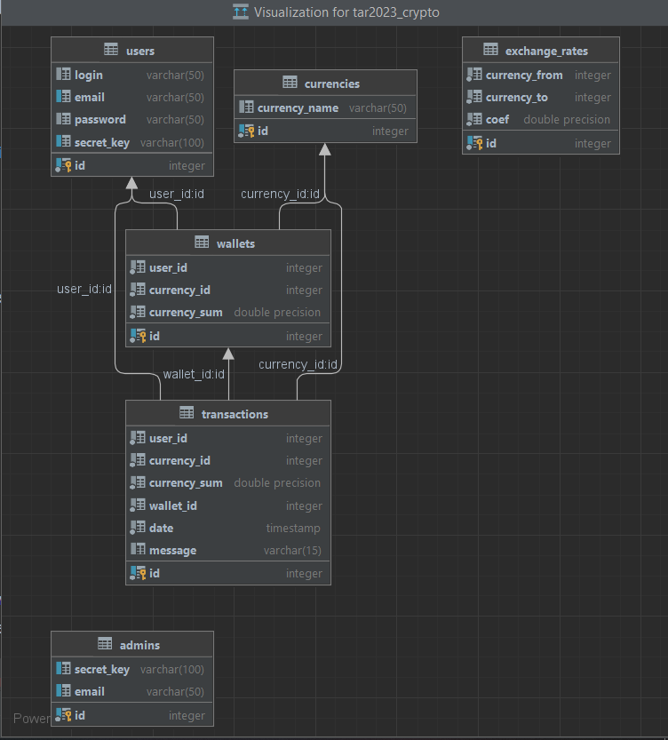

# RELEX_test_assignment
# Биржа
# Видеопрезентация кратко: [Mock link](https://www.youtube.com/watch?v=oHg5SJYRHA0)
## Видеопрезентация полностью: [Mock link](https://www.youtube.com/watch?v=oHg5SJYRHA0)
***
## Краткое описание исходного задания:
Требуется разработать RESTfull API service — биржу для проведения торгов криптовалютами.
### Обязательные требования:
* Spring Boot;
* возвращаемые данные в формате Json;
* хранилище данных.
* роли: админ/пользователь
### Дополнительно:
- [ ] Swagger ***(сделан Postman)***
- [x] PostgreSql
- [ ] Spring Security
- [ ] accept:application/json или accept:application/xml к HTTP-запросу
- [ ] верификация письмом
- [ ] сервис по запросу может возвращать данные в json ИЛИ xml.
- [ ] формат может быть изменен добавлением header
> В упрощенном варианте достаточно при получении запроса проверять полученный secret_key — если данный метод доступен только администратору и  secret_key тоже принадлежит  администратору, то выполнять операцию, а иначе возвращать http статус — 403 Forbidden
***
# Реализация
## Подробно про технологии:
- SpringBoot
- Gradle
- Postgres + Liquibase для менеджмента скриптов
- Hibernate
- JPA (JpaRepository) для гибких запросов в бд
- WebMVC
- Mapstruct
- Validators
- Lombok (@RequiresArgsConstructor, @Getter/@Setter)
- SpringSecurity.TextEncryptor (для генерации строки по некоторому уникальному полю приходящего дто)

## Допы:
- тесты для API через Postman
- кастомные валидаторы для почты и логина (@EmailUnique, @LoginUnique)
- логгер SLF4J для вывода сообщений о запрошенных операциях в консоль

***

## Структура БД
)

***
## Подробно про API:
### User:

### Admin:

