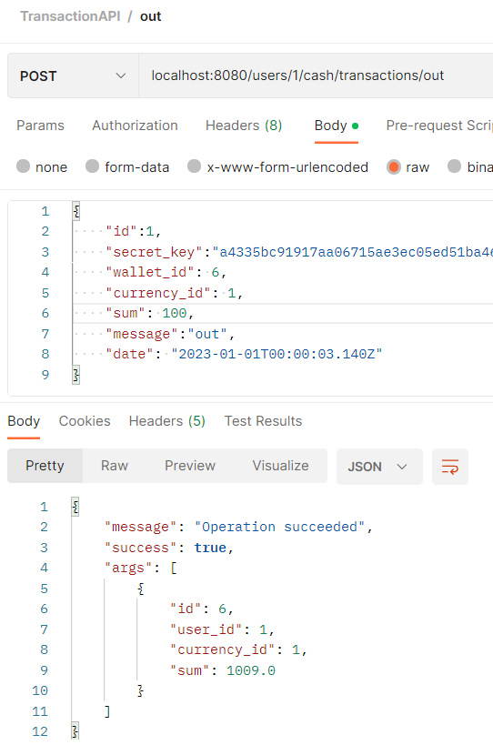

# RELEX_test_assignment
# Биржа
# Видеопрезентация: [link](https://drive.google.com/drive/folders/18PvWD-rAovmzwYA_kUDcd_sJDYA8fbCu?usp=sharing)
***
## Краткое описание исходного задания:
Требуется разработать RESTfull API service — биржу для проведения торгов криптовалютами.
### Обязательные требования:
* Spring Boot;
* возвращаемые данные в формате Json;
* хранилище данных.
* роли: админ/пользователь
### Дополнительно:
- [ ] Swagger ***(сделан Postman)***
- [x] PostgreSql
- [ ] Spring Security
- [ ] accept:application/json или accept:application/xml к HTTP-запросу
- [ ] верификация письмом
- [ ] сервис по запросу может возвращать данные в json ИЛИ xml.
- [ ] формат может быть изменен добавлением header
> В упрощенном варианте достаточно при получении запроса проверять полученный secret_key — если данный метод доступен только администратору и  secret_key тоже принадлежит  администратору, то выполнять операцию, а иначе возвращать http статус — 403 Forbidden
***
# Реализация
## Подробно про технологии:
- SpringBoot
- Gradle
- Postgres + Liquibase для менеджмента скриптов
- Hibernate
- JPA (JpaRepository) для гибких запросов в бд
- WebMVC
- Mapstruct
- JavaX Validators
- Lombok (@RequiresArgsConstructor, @Getter/@Setter)
- SpringSecurity.TextEncryptor (для генерации строки по некоторому уникальному полю приходящего дто)

## Допы:
- тесты для API через Postman 
> Приглашение для workspace: https://app.getpostman.com/join-team?invite_code=b8f2c5577b1cae7a8ae397be1432ebfe&target_code=363abd10cf151dbf8448435771af1129
>
> После принятия может выскочить ошибка 500, это нормально, так как приглашение уже будет недействительным. Ниже название и айдишник, чтобы найти его в своем профиле Postman.
>
> Workspace Id: 666c2991-2828-445d-aa44-1e1a945e3391
>
> Workspace Name: CryptoTrade_Relex2023
> 
> Воркспейс выглядит следующим образом:
> 
> 

- кастомные валидаторы для почты и логина (@EmailUnique, @LoginUnique)
- логгер SLF4J для вывода сообщений о запрошенных операциях в консоль
- безопасность простейшим способом (через проверку secretKey)

***

## Структура БД
)

***
## Подробно про API:
Предполагается, что все манипуляции приложением будут идти через личный
кабинет (например, так сделано во многих банковских приложениях с 
инвестициями и прочим), поэтому вся работа с валютой и транзакциями будет
включать в пути _users/{userID}_. 

### Пользователь:
- создать нового пользователя

- удалить пользователя

- список всех

### Администратор:
- Создание нового администратора

- Удаление администратора

- Список всех

### Валюта:
- Список всех валют

- Создание валюты

- Удаление валюты

- Сумма по валюте
  

### Обменные коээфициенты:
- для двух конкретных валют
 

- все обменные к-ты

- изменить обменный к-т

- создать обменный к-т

- удалить обменный к-т

### Транзакции
- вывести валюту

- внести валюту

- перевести валюту с кошелька на кошелек (и обменять при этом, если нужно)

- история транзакций пользователя

- вся история транзакций

- число транзакций в заданном промежутке времени

### Счета (кошельки)
- все кошельки списком

- все кошельки одного пользователя

- конкретный кошелек

- создать кошелек

- удалить кошелек

